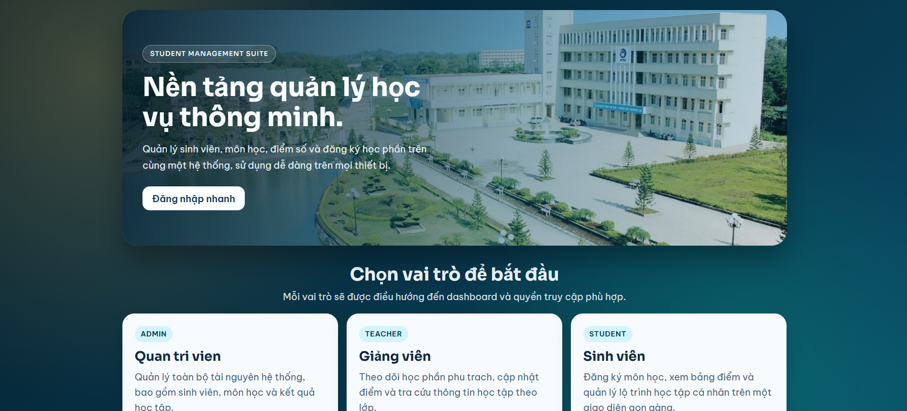
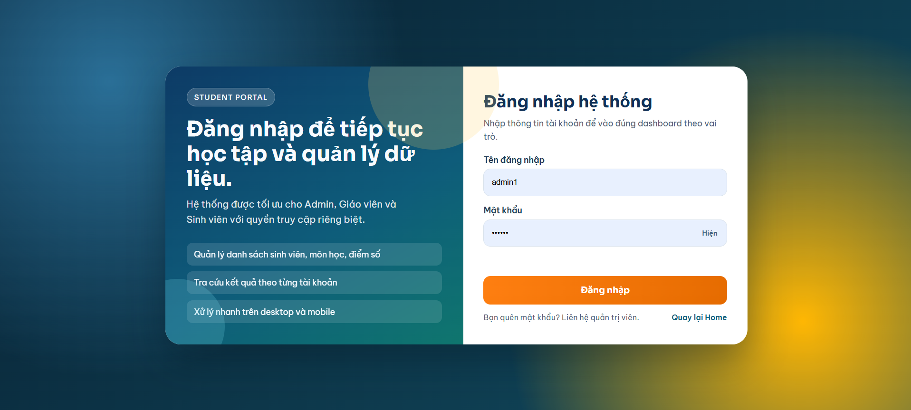
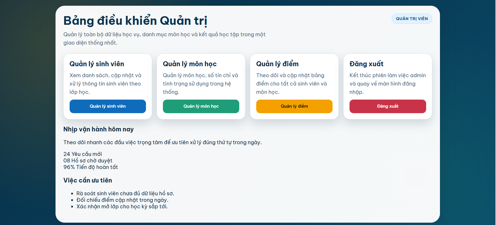
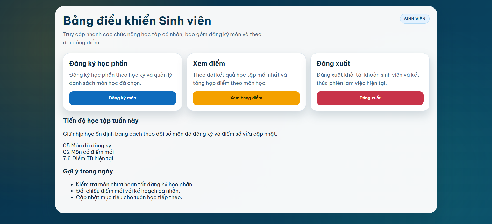
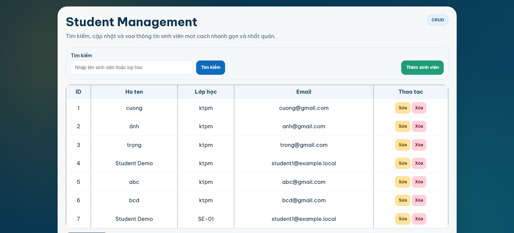
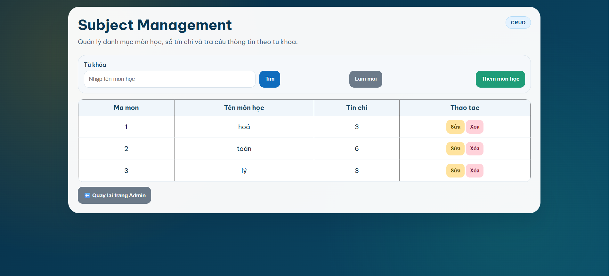
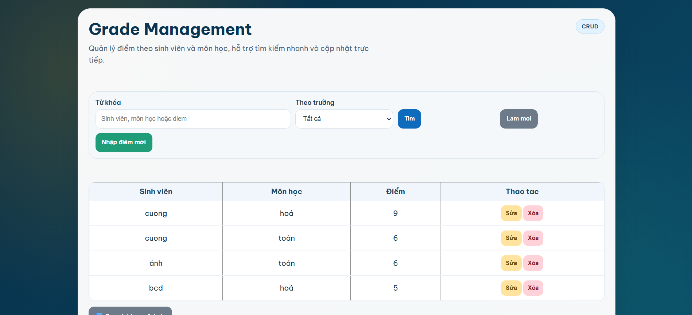
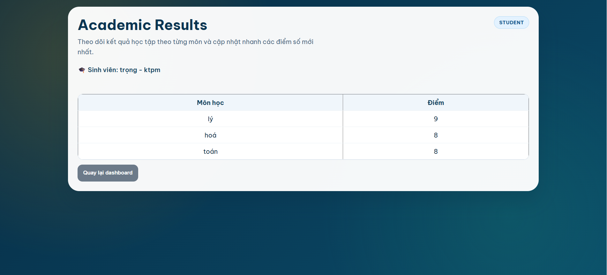
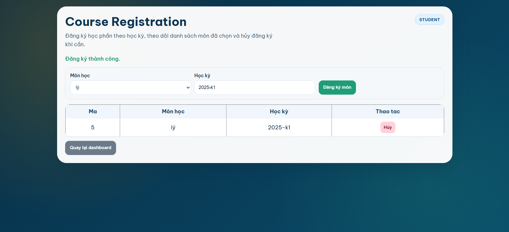

# demo_3layer1 - He thong quan ly sinh vien (Web Forms, 3-layer)

Du an ASP.NET Web Forms su dung kien truc 3 tang:
- Presentation/UI
- Business
- DataAccess

Ban split nay tach thanh 2 web app de van hanh:
- Backend: danh cho Admin/Teacher
- Frontend: danh cho Student

## 1) Cong nghe su dung

- .NET Framework 4.7.2
- ASP.NET Web Forms
- Entity Framework 6 (Code First + Migrations)
- SQL Server LocalDB
- IIS Express

## 2) Cau truc chinh

```text
README.md
demo_3layer1/
	demo_3layer1_split.sln
	demo_3layer1/            # ban legacy
	demo_3layer1_backend/    # web backend (Admin/Teacher)
	demo_3layer1_frontend/   # web frontend (Student)
	packages/
```

## 3) Chay nhanh tren Windows (VS Code)

Yeu cau:
- Da cai Visual Studio Build Tools/Visual Studio 2022
- Da co IIS Express (thuong nam o `C:\Program Files\IIS Express\iisexpress.exe`)

### Chay Backend (Admin/Teacher)

```powershell
Start-Process -FilePath "C:\Program Files\IIS Express\iisexpress.exe" -ArgumentList '/path:"C:\Users\Admin\Downloads\demo_3layer1\demo_3layer1\demo_3layer1_backend" /port:18081'
```

Mo trang dang nhap:

```text
http://localhost:18081/UI/Login/Login
```

### Chay Frontend (Student)

```powershell
Start-Process -FilePath "C:\Program Files\IIS Express\iisexpress.exe" -ArgumentList '/path:"C:\Users\Admin\Downloads\demo_3layer1\demo_3layer1\demo_3layer1_frontend" /port:18082'
```

Mo trang dang nhap:

```text
http://localhost:18082/UI/Login/Login
```

### Dung IIS Express

```powershell
Stop-Process -Name iisexpress -Force
```

## 4) Demo man hinh

Anh demo duoc dat trong folder `demo_3layer1/demo_3layer1/img`.

### Trang chu


### Dang nhap


### Dashboard Admin


### Dashboard Sinh vien


### Quan ly sinh vien


### Quan ly mon hoc


### Them diem


### Sinh vien xem diem


### Dang ky hoc


## 5) Ghi chu

- Neu can chay migration EF6, nen chay bang Visual Studio (Package Manager Console) de tranh loi target cua WebApplication tren CLI.
- Cac project backend/frontend da duoc tach de trien khai va test doc lap.
